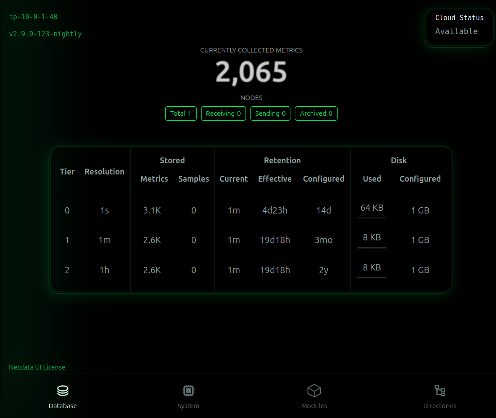
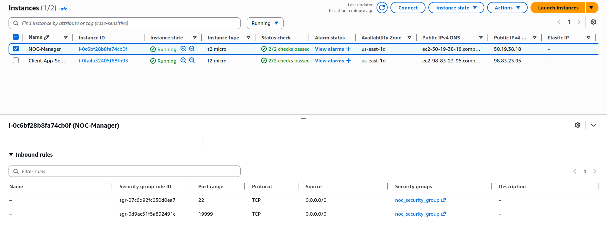
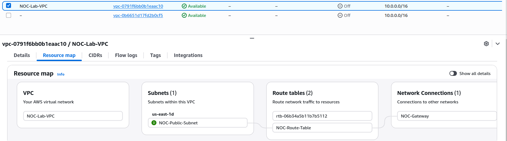

# 📡 AWS NOC Monitoring Lab

## 🚀 Overview
Automated **NOC Monitoring Lab** using **Terraform** on **AWS**. This project deploys a secure VPC with monitoring agents to track network health.

## 🖼️ Project Screenshots

### 1. Real-time Monitoring (Netdata Dashboard)
This proves the monitoring agent is active and collecting metrics.

### 2. Infrastructure Security (Inbound Rules)
Security Groups configured for SSH (22) and Netdata (19999).

### 3. AWS Resource Map
Logical view of the VPC, Subnets, and Gateway.

